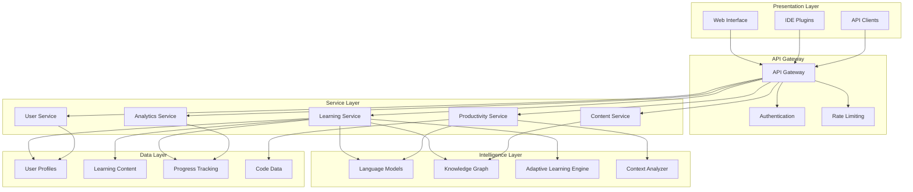

# Design Document: AI Learning Assistant

## Overview

The AI Learning Assistant is a comprehensive, adaptive learning platform that combines personalized tutoring, developer productivity tools, and intelligent knowledge organization. The system leverages modern AI techniques including large language models, knowledge graphs, and adaptive learning algorithms to create a seamless learning experience that adapts to individual users' needs, skill levels, and learning preferences.

The architecture follows a modular, microservices-based approach with clear separation between learning intelligence, content delivery, user modeling, and productivity tools. This design enables scalability, maintainability, and extensibility while providing real-time personalization and contextual assistance.

## Architecture

The system employs a layered architecture with the following key components:

### Core Architecture Layers

1. **Presentation Layer**: Multi-modal user interfaces (web, IDE plugins, mobile)
2. **API Gateway**: Request routing, authentication, and rate limiting
3. **Service Layer**: Microservices for learning, productivity, and content management
4. **Intelligence Layer**: AI models, knowledge graphs, and adaptive algorithms
5. **Data Layer**: User profiles, learning content, progress tracking, and analytics

### System Architecture Diagram



## Components and Interfaces

### Learning Service

**Responsibilities:**

- Manages personalized learning sessions and adaptive tutoring
- Coordinates with knowledge graph for concept relationships
- Tracks learning progress and adjusts difficulty dynamically
- Generates explanations and learning materials

**Key Interfaces:**

```typescript
interface LearningService {
  startLearningSession(userId: string, topic: string): LearningSession;
  adaptDifficulty(sessionId: string, performance: PerformanceMetrics): void;
  generateExplanation(concept: string, userLevel: SkillLevel): Explanation;
  trackProgress(userId: string, concept: string, mastery: number): void;
}

interface LearningSession {
  id: string;
  userId: string;
  topic: string;
  currentDifficulty: DifficultyLevel;
  learningPath: ConceptNode[];
  progress: ProgressState;
}
```

### Productivity Service

**Responsibilities:**

- Provides code analysis and debugging assistance
- Offers workflow optimization recommendations
- Integrates with development environments
- Maintains project context awareness

**Key Interfaces:**

```typescript
interface ProductivityService {
  analyzeCodebase(projectPath: string): CodebaseAnalysis;
  debugAssistance(error: ErrorContext): DebuggingSuggestion[];
  optimizeWorkflow(workflowData: WorkflowMetrics): OptimizationRecommendation[];
  explainCode(codeSnippet: string, context: ProjectContext): CodeExplanation;
}

interface CodebaseAnalysis {
  architecture: ArchitectureOverview;
  dependencies: DependencyGraph;
  complexity: ComplexityMetrics;
  recommendations: string[];
}
```

### Knowledge Graph Service

**Responsibilities:**

- Maintains relationships between concepts, skills, and learning materials
- Supports prerequisite tracking and learning path generation
- Enables semantic search and content discovery
- Provides concept similarity and recommendation capabilities

**Key Interfaces:**

```typescript
interface KnowledgeGraphService {
  getPrerequisites(concept: string): ConceptNode[];
  findLearningPath(from: string, to: string): LearningPath;
  getRelatedConcepts(concept: string): ConceptNode[];
  updateConceptMastery(userId: string, concept: string, level: number): void;
}

interface ConceptNode {
  id: string;
  name: string;
  description: string;
  prerequisites: string[];
  difficulty: DifficultyLevel;
  learningMaterials: LearningMaterial[];
}
```

### Adaptive Learning Engine

**Responsibilities:**

- Implements personalization algorithms based on user behavior
- Manages difficulty adjustment and pacing optimization
- Provides learning analytics and progress predictions
- Coordinates multi-modal learning preferences

**Key Interfaces:**

```typescript
interface AdaptiveLearningEngine {
  personalizeContent(
    userId: string,
    content: LearningMaterial,
  ): PersonalizedContent;
  adjustDifficulty(
    userId: string,
    performance: PerformanceData,
  ): DifficultyAdjustment;
  predictLearningOutcome(userId: string, concept: string): LearningPrediction;
  optimizePacing(
    userId: string,
    sessionData: SessionMetrics,
  ): PacingRecommendation;
}

interface PersonalizationModel {
  userId: string;
  learningStyle: LearningStyle;
  skillLevels: Map<string, number>;
  preferences: UserPreferences;
  performanceHistory: PerformanceMetrics[];
}
```

## Data Models

### User Profile Model

```typescript
interface UserProfile {
  id: string;
  email: string;
  preferences: {
    learningStyle: "visual" | "auditory" | "kinesthetic" | "mixed";
    difficultyPreference: "adaptive" | "challenging" | "comfortable";
    sessionLength: number; // minutes
    notificationSettings: NotificationPreferences;
  };
  skillLevels: Map<string, SkillLevel>;
  learningGoals: LearningGoal[];
  progressHistory: ProgressEntry[];
  createdAt: Date;
  updatedAt: Date;
}

interface SkillLevel {
  concept: string;
  mastery: number; // 0-1 scale
  confidence: number; // 0-1 scale
  lastAssessed: Date;
  assessmentCount: number;
}
```

### Learning Content Model

```typescript
interface LearningMaterial {
  id: string;
  title: string;
  description: string;
  type: "explanation" | "exercise" | "example" | "assessment";
  difficulty: DifficultyLevel;
  concepts: string[];
  prerequisites: string[];
  content: {
    text?: string;
    code?: CodeExample[];
    diagrams?: DiagramData[];
    interactive?: InteractiveElement[];
  };
  metadata: {
    estimatedTime: number;
    language?: string;
    framework?: string;
    tags: string[];
  };
}

interface CodeExample {
  language: string;
  code: string;
  explanation: string;
  runnable: boolean;
  expectedOutput?: string;
}
```

### Progress Tracking Model

```typescript
interface ProgressEntry {
  id: string;
  userId: string;
  concept: string;
  sessionId: string;
  timestamp: Date;
  activity: {
    type: "explanation_viewed" | "exercise_completed" | "assessment_taken";
    duration: number;
    success: boolean;
    attempts: number;
    hints_used: number;
  };
  performance: {
    accuracy: number;
    speed: number;
    confidence: number;
  };
  adaptations: {
    difficultyAdjusted: boolean;
    contentPersonalized: boolean;
    pacingModified: boolean;
  };
}
```

### Project Context Model

```typescript
interface ProjectContext {
  id: string;
  userId: string;
  projectPath: string;
  metadata: {
    language: string;
    framework: string[];
    dependencies: Dependency[];
    architecture: ArchitectureType;
  };
  codebase: {
    files: FileAnalysis[];
    structure: DirectoryTree;
    complexity: ComplexityMetrics;
  };
  workflowData: {
    buildSystem: string;
    testFramework: string[];
    deploymentTarget: string;
    commonTasks: WorkflowTask[];
  };
}
```

Now I need to use the prework tool to analyze the acceptance criteria before writing the Correctness Properties section:

## Correctness Properties

_A property is a characteristic or behavior that should hold true across all valid executions of a system—essentially, a formal statement about what the system should do. Properties serve as the bridge between human-readable specifications and machine-verifiable correctness guarantees._

### Property 1: Initial Assessment Consistency

_For any_ new user interacting with the system for the first time, the Learning_Assistant should conduct an assessment and initialize their skill levels based on their responses.
**Validates: Requirements 1.1**

### Property 2: Adaptive Difficulty Management

_For any_ user and learning session, when performance consistently exceeds or falls below thresholds, the Adaptive_Tutor should adjust difficulty appropriately while respecting user pace preferences.
**Validates: Requirements 1.2, 4.4, 9.1, 9.2, 9.5**

### Property 3: Learning Style Adaptation

_For any_ user with specified learning preferences, the system should adapt content delivery to match their preferred learning style (visual, auditory, hands-on).
**Validates: Requirements 1.5, 7.1, 7.2**

### Property 4: Alternative Explanation Generation

_For any_ concept where a user demonstrates struggle, the Adaptive_Tutor should provide alternative explanations using different approaches or teaching methods.
**Validates: Requirements 1.3, 9.4**

### Property 5: Mastery-Based Progression

_For any_ user who demonstrates mastery of a topic, the Learning_Assistant should automatically progress to more advanced concepts in the learning path.
**Validates: Requirements 1.4, 4.3**

### Property 6: Multi-Layered Explanation Quality

_For any_ technical concept explanation request, the Concept_Explainer should provide content with multiple complexity layers, practical examples, analogies, and step-by-step breakdowns as appropriate.
**Validates: Requirements 2.1, 2.2, 2.4, 7.3**

### Property 7: Prerequisite-Aware Learning Paths

_For any_ concept with prerequisites, the Learning_Assistant should identify foundational topics and offer to explain them before proceeding to the requested concept.
**Validates: Requirements 2.3, 4.1**

### Property 8: Visual Architecture Representation

_For any_ system architecture explanation request, the Concept_Explainer should provide visual diagrams and component relationship information.
**Validates: Requirements 2.5**

### Property 9: Comprehensive Codebase Analysis

_For any_ codebase analysis request, the Code_Helper should provide architectural overviews, component relationships, and technology stack identification.
**Validates: Requirements 3.1, 6.1**

### Property 10: Context-Aware Code Assistance

_For any_ code suggestion, debugging assistance, or refactoring request within a project context, the Code_Helper should maintain consistency with existing code style, patterns, and dependencies.
**Validates: Requirements 3.4, 6.2, 6.4, 6.5**

### Property 11: Error Context Integration

_For any_ debugging request, the Code_Helper should provide suggestions that reference specific project files, line numbers, and error patterns when available.
**Validates: Requirements 3.2, 6.3**

### Property 12: Code Review Intelligence

_For any_ code review request, the Code_Helper should explain complex logic and identify potential improvements while preserving functionality.
**Validates: Requirements 3.3, 6.5**

### Property 13: Documentation Processing

_For any_ documentation analysis request, the Code_Helper should generate summaries and extract key implementation details.
**Validates: Requirements 3.5**

### Property 14: Corrective Feedback Loop

_For any_ incorrect user response during learning sessions, the Adaptive_Tutor should provide corrective feedback and additional practice opportunities.
**Validates: Requirements 4.2**

### Property 15: Session Completion Handling

_For any_ completed learning session, the Learning_Assistant should provide summaries and recommend appropriate next steps.
**Validates: Requirements 4.5**

### Property 16: Knowledge Organization and Tracking

_For any_ learning activity, the Knowledge_Organizer should maintain structured records, connect new concepts to existing knowledge, and provide progress visualizations.
**Validates: Requirements 5.1, 5.2, 5.3**

### Property 17: Knowledge Gap Identification

_For any_ user's learning profile, the Learning_Assistant should identify knowledge gaps and suggest targeted learning opportunities.
**Validates: Requirements 5.5**

### Property 18: Relevant Content Surfacing

_For any_ review of past learning, the Knowledge_Organizer should surface relevant materials and connections based on the current context.
**Validates: Requirements 5.4**

### Property 19: Multi-Modal Learning Support

_For any_ learning session, the Learning_Assistant should support both synchronous tutoring and asynchronous learning materials based on user needs.
**Validates: Requirements 7.4**

### Property 20: Reference Material Generation

_For any_ request for summary documents or reference materials, the Concept_Explainer should provide appropriately formatted content.
**Validates: Requirements 7.5**

### Property 21: Workflow Optimization Intelligence

_For any_ development workflow analysis, the Workflow_Assistant should identify automation opportunities, suggest organizational improvements, and recommend relevant tools.
**Validates: Requirements 8.1, 8.2, 8.3**

### Property 22: Bottleneck Resolution

_For any_ detected workflow bottleneck, the Workflow_Assistant should propose alternative approaches and methodological guidance.
**Validates: Requirements 8.4, 8.5**

### Property 23: Engagement-Based Session Adaptation

_For any_ learning session, the Learning_Assistant should monitor engagement levels and adjust session parameters (length, intensity) accordingly.
**Validates: Requirements 9.3**

### Property 24: IDE Integration Compatibility

_For any_ popular development environment, the Learning_Assistant should integrate without disrupting existing workflows while providing contextual help.
**Validates: Requirements 10.1, 10.2**

### Property 25: Plugin Architecture Support

_For any_ new domain extension, the Learning_Assistant should support plugin architectures that integrate properly with the core system.
**Validates: Requirements 10.3**

### Property 26: Content Import and Export

_For any_ external learning resource or progress data, the Knowledge_Organizer should import content appropriately and export data in standard formats for portability.
**Validates: Requirements 10.4, 10.5**

## Error Handling

The system implements comprehensive error handling across all components:

### Learning Service Error Handling

- **Invalid User Input**: Graceful handling of malformed learning requests with helpful error messages
- **Knowledge Graph Unavailability**: Fallback to cached concept relationships and basic explanations
- **Model Service Failures**: Degraded functionality with pre-generated content and retry mechanisms
- **Session State Corruption**: Automatic session recovery with progress preservation

### Productivity Service Error Handling

- **Codebase Analysis Failures**: Partial analysis results with clear indication of limitations
- **IDE Integration Issues**: Fallback to web-based interface with notification to user
- **Context Loss**: Graceful degradation with request for context re-establishment
- **Large File Processing**: Chunked processing with progress indicators and timeout handling

### Data Consistency and Recovery

- **User Profile Corruption**: Automatic backup restoration with minimal data loss
- **Progress Tracking Failures**: Temporary local storage with eventual consistency
- **Knowledge Graph Inconsistencies**: Automated validation and repair processes
- **Concurrent Access Issues**: Optimistic locking with conflict resolution

### Integration Error Handling

- **External API Failures**: Circuit breaker patterns with exponential backoff
- **Plugin Failures**: Isolated error handling preventing system-wide issues
- **Authentication Issues**: Clear error messages with recovery instructions
- **Rate Limiting**: Intelligent queuing with user notification

## Testing Strategy

The AI Learning Assistant employs a comprehensive dual testing approach combining unit testing for specific scenarios and property-based testing for universal correctness guarantees.

### Property-Based Testing Configuration

**Framework Selection**: The system uses Hypothesis (Python) for property-based testing, configured to run a minimum of 100 iterations per property test to ensure comprehensive input coverage through randomization.

**Test Tagging**: Each property-based test includes a comment tag referencing its corresponding design document property:

- Format: `# Feature: ai-learning-assistant, Property {number}: {property_text}`
- Example: `# Feature: ai-learning-assistant, Property 1: Initial Assessment Consistency`

**Property Test Implementation**: Each correctness property from the design document is implemented as a single property-based test that validates the universal behavior across all valid inputs.

### Unit Testing Strategy

Unit tests complement property-based tests by focusing on:

**Specific Examples**: Concrete test cases that demonstrate correct behavior for known scenarios

- User onboarding flows with specific skill assessments
- Code analysis results for sample projects
- Learning path generation for defined concept hierarchies

**Edge Cases**: Boundary conditions and exceptional scenarios

- Empty codebases or minimal project structures
- Users with no prior learning history
- Concepts with circular prerequisite dependencies
- Maximum complexity learning materials

**Integration Points**: Component interaction validation

- Learning Service coordination with Knowledge Graph
- Productivity Service integration with IDE plugins
- User authentication and session management
- External API integration reliability

**Error Conditions**: Failure scenario handling

- Network connectivity issues during learning sessions
- Malformed user input and invalid requests
- Resource exhaustion and performance degradation
- Data corruption and recovery procedures

### Testing Coverage Requirements

**Functional Coverage**: All acceptance criteria from requirements document must have corresponding test coverage through either unit tests or property-based tests.

**Performance Testing**: Load testing for concurrent users, response time validation for real-time features, and scalability testing for knowledge graph operations.

**Security Testing**: Authentication and authorization validation, input sanitization verification, and data privacy compliance testing.

**Compatibility Testing**: Cross-platform IDE integration testing, browser compatibility for web interfaces, and API version compatibility validation.
